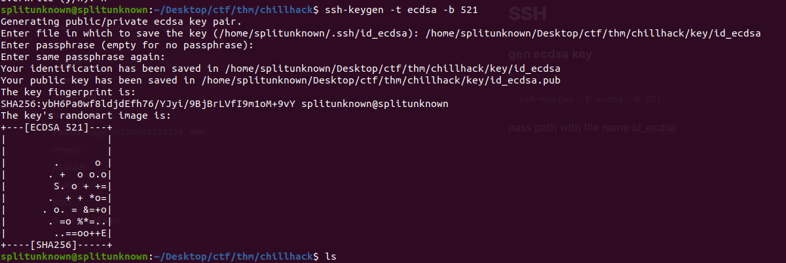
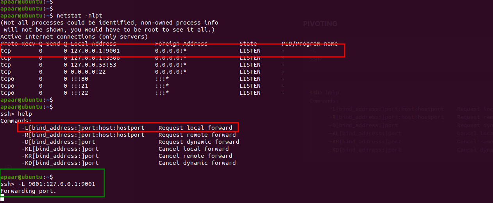

##### gen ecdsa key

```bash
ssh-keygen -t ecdsa -b 521
```

pass path with file name _id_ecdsa_



##### public key to authorised_keys

with echo move public key to authorised keys

```bash
echo "ecdsa-sha2-nistp521 AAAAE2VjZHNhLXNoYTItbmlzdHA1MjEAAAAIbmlzdHA1MjEAAACFBAF8RoPKOXwQx2cl9ChH2VbZif9nsWHPE8UAMAdK7eMyUzBHvHsr9QeRmtVnO+V1nZh3q6EPW04k6mF8jbZbNTGBGAGvyQ0qMiuT68oR64ouKCqy9rro7+uWl3738G6HSqge5rv35gwwGe2ZVNlx4SsuI+PsRFSvqi09j0IuHQEqXTEbPw== splitunknown@splitunknown" >> authorized_keys
```

##### ssh to server

```bash
ssh -i key/id_ecdsa apaar@10.10.10.162
```

##### PIVOTING

```bash
netstat -nlpt
(Not all processes could be identified, non-owned process info
 will not be shown, you would have to be root to see it all.)
Active Internet connections (only servers)
Proto Recv-Q Send-Q Local Address           Foreign Address         State       PID/Program name
tcp        0      0 127.0.0.1:9001          0.0.0.0:*               LISTEN      -
tcp        0      0 127.0.0.1:3306          0.0.0.0:*               LISTEN      -
```

```bash
~C
ssh>
```

```bash
ssh> help
Commands:
      -L[bind_address:]port:host:hostport    Request local forward
      -R[bind_address:]port:host:hostport    Request remote forward
      -D[bind_address:]port                  Request dynamic forward
      -KL[bind_address:]port                 Cancel local forward
      -KR[bind_address:]port                 Cancel remote forward
      -KD[bind_address:]port                 Cancel dynamic forward
```

```ssh
ssh> -L 9001:127.0.0.1:9001
Forwarding port.
```


